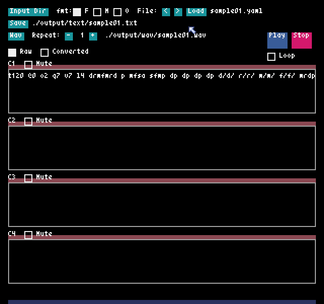

# py_humanreadable_mml

ドレミファという音名しかわからなくても直感的に書ける独自MMLライブラリ・ツール



## 機能

本ライブラリ独自のMMLをpyxelで使える正規のMMLに変換します。

## 目的

一般的な音名表記 cdefgab が分かりづらく馴染めない、そもそも音楽やMMLに馴染みがない人向けに作りました。（主に私ですが）

MMLが分かる人からするとおそらく紛らわしいため、本格的な作曲用途には向かないと思いますが、ドレミファソラシはd r m f s a si(またはc) と、学校で習う音の表記に近いかたちで書けます。

※以後、 独自MML と表記します。

## 特徴

### 独自フォーマット1（フルカスタムMML）

音楽の知識がなくてもフィーリングでなんとか作曲できるよう、表記を工夫しています。

※元のMMLでもあり得ない表記は変換ができません。  
※音符はpyxel editorのサウンドエディタのように、1小節で8つを想定しています。

ドレミファソラシ: `d r m f s a c`

休符: p

音の長さを延ばす: -  
例： `d---` 4/4の場合、ドの2分音符(元: `c2` )  
つまり「ドーーー」という **漫画などのセリフで叫んでいるような** 延ばす表記で書ける。

音の長さを短くする: /  
例：`d/` 4/4の場合、ドの8分音符

音を高くする（オクターブを上げる）: ^

音を低くする（オクターブを下げる）: _

音楽の知識がない人（私）がとにかく、下手をすると暗号かよと思ってしまうMMLの表記を、サラッと書けるようにしたかったので、MMLの `>` や `<` 、 `c8` `r16` などとMMLの仕様上は理にかなっていても、音楽の素人が見て直感的でない表記はしません。

音を伸ばしたければ世間的によく見る - (棒線)をつければつけた分だけ伸びる。  
 `^` が付いてるから音が上がるんだな？と見えるようになる。  
これだけでもわかりやすくなると思いました。


※注意点

* シを `s` とするとソと重複するため、`c` または `si` としました。
* ラを `r`とすると `レ` 、`l` とすると音と休符の長さの `l` と重複するため、元のMMLの表記 `a` をそのまま採用しています。

※ラがaというのを納得するなら、(l)a だからとするとよいかと。  
※つまり上の前歯の裏に舌をつけて発音する「ぅあ」だからaなんだな、などと。

### 独自フォーマット2（ミドルカスタムMML）

こちらは次の形式のみ正規のMMLと異なる記法です。

ドレミファソラシ: `d r m f s a c`

音を高くする（オクターブを上げる）: ^

音を低くする（オクターブを下げる）: _

休符: p

最低限MMLが分かってきたけど、せめてドレミファソラシは元の音をイメージする記述を使いたい場合向けです。  
ほかは正規のMMLと同じため、移行はスムーズになります。


## 内容

src/pyhuremml.py

ライブラリです。importして関数を呼び出すだけです。

### 関数

`custom_mml_to_mml(custom_mml: str)`

本ライブラリ独自MML(フルカスタム)をpyxelで使用可能なMMLに変換してその文字列を返す。

`midcustom_mml_to_mml(custom_mml: str)`

本ライブラリ独自MML(ミドルカスタム)をpyxelで使用可能なMMLに変換してその文字列を返す。

* src/sample1.py
* src/sample2.py
* src/sample3.py

ライブラリを呼び出して使った場合のサンプルです。pまたはSPACEキーで再生を確認します。

src/playtool.py

本ライブラリのMML書式をpyxelで使用可能なMMLに変換し、再生するツールです。  
wavにも変換できます。

src/mycls.py

pyxelで使える簡単な自前のUIライブラリです。


input/ 入力のYAMLファイルを置くフォルダ  
output/text 正規のMMLが出力されるフォルダ  
output/wav wavファイルが出力されるフォルダ


音楽やMMLに詳しい方は、outtext.txtに正規のMMLが出力されますので、それをお使いください。

また、wavファイルを出力できるので、pyxel以外でも、BGMやSEを作るのに使えます。


## ツール

独自MMLを書いたテキストファイル/YAMLファイルを正規のMMLに変換し、その場で再生して聞けるツールです。  
また、このツールのテキストファイル/YAMLファイルの書き方を正規のMMLでも享受できるよう、オプションを用意しています。
切り替えれば正規のMMLを書いて再生・wav出力もできます。

### 使用方法

1. pip install pyxel
2. python src/playtool.py
3. src/inputフォルダ内で好きなテキストエディタでyamlファイルを作成し、保存します。
4. ツールのInput Dirボタンを押し、inputフォルダ内を再読み込みします。
5. yamlが複数ある場合は `<` `>` でファイルを切り替えます。（ファイル選択中に編集した場合はloadボタンを押して再読み込みします）
6. playボタンで再生します。
7. 問題なければsaveボタンを押します。開いたファイルと同名の.txtファイルがoutputフォルダに正規のMMLとして保存されます。
8. wavファイルに保存する場合は wavボタンを押します。

*読み込みフォーマットを切り替える*

Formatのチェックボックスを切り替えます。

* F - 独自MML(フルカスタム)
* M - 独自MML(ミドルカスタム)
* O - 正規のMML

このフォーマットを切り替えることにより、テキストファイル/YAMLファイルに書くのを正規のMMLとすることができます。

*inputフォルダ内を再読み込みする*

`Input Dir` ボタンを押します。中にあるyamlファイルのファイルパスを取得します。

*yamlファイルの選択を切り替える*

`<` `>` ボタンを押すと聴くyamlファイルを選択します。  
`<` はキーボードの左矢印キー、`>` は右矢印キーに対応しています。

yamlファイル内の `format` プロパティで指定したフォーマットが自動的に選択され読み込まれます。


*編集したyamlファイルを再読み込みする*

loadボタンか、キーボードの Lキーを押します。

※現在選択中のYAMLファイルを編集した場合、この操作をしてください。

※テキストファイル/YAMLファイルを編集した場合、必ずloadボタンを押す前にFormatを目的のフォーマットの方に切り替えてください。


*再生する*

playボタンか、キーボードの PキーまたはSPACEキーを押します。


*停止する*

stopボタンか、キーボードの Sキーを押します。


*ミュートにする*

特定のチャンネルをミュートにする場合はチャンネル名の隣のチェックボックスをONにします。  
※キーボードの1～4がそれぞれのチャンネルのMuteのチェックボックスに対応しています。


*MMLの表示を切り替える*

* Raw - 本ライブラリ独自MMLを表示（Format=oの場合はこちらも正規のMML）
* Converted - pyxelで使用可能なMMLを表示


*正規のMMLを出力する*

saveボタンを押します。  
同じフォルダのouttext.txtに出力される。チャンネルで改行されます。  
※mmltext.yamlで改行で分けていた場合、改行はなくなり1チャンネル1行で出力されます。


*wavファイルを出力する*

wavボタンを押します。


*wav出力時の繰り返し数を変える*

Repeat:  +と-で数値を変更します。
※指定した分だけ曲が繰り返されてwavファイルに収録されます。


### 記述方法

YAML形式で、最大４チャンネルまで記述できます。

```yaml
mml:
    format: f
    c1:
    - t120 @0 o2 q7 v7 l4 ddrd aaf- ^mm_si-
    c4:
    - t120 @2 o2 q7 v7 l4 _s--- s--- v3 s---
```

format:

記述するMMLのフォーマットが何かを記載します。値は次のようになっています。

* f - 独自MML(フルカスタム)
* m - 独自MML(ミドルカスタム)
* o - 正規のMML

省略時は `f` です。

チャンネル: c1~c4

pyxel上ではチャンネル 0～3 に対応しています。  
記述が長すぎる場合、 - で行を分けて記述できます。


なお、正規のMMLではYAMLの記法上、" "で囲まないと正しく解釈されない記号も存在します。  
例： `>>c` など


### 便利な記述方法

MMLでの作曲と実際の楽譜に慣れてない方は例えば、1行で2小節を書く、などと書き方を工夫するとよいかもしれません。

```yaml
mml:
    format: f
    c1:
    - t250 @2 o2 q7 v7 l4
    - drmf sac^d_
    - drmf sac^d_
    
    c2:
    - t250 @3 o2 q7 v3 l4
    - ^d_cas fmrd
    - ^d_cas fmrd

    tmp:
    - drdrm  ffaa^d
    - 以下は仮の作曲としよう
    - mmf- ^mmf-_
```

なお、`format` 、 `c1` ～ `c4` 以外のプロパティは読み込みでは無視されます。そのため一時的にメモしておきたい記述は適当なプロパティ名で除けておくとよいでしょう。例えばコメントを書いておくのも問題ありません。

長い作曲をしているときに、たとえば1～4小節目はできた。5小節目から試聴したいということもあると思います。

1～4小節目を作った1～2行目は一時的に別のプロパティに除けておき、5小節目である3行目からいきなり再生するという使い方もできます。


## 独自MML要素変換テーブル

リポジトリに同梱の xlsxファイルをご覧ください。

全体に影響する書式は正規のMMLに沿っています。


pyxelのMMLの記述方法は下記をご覧ください。

[Pyxel よくある質問](https://github.com/kitao/pyxel/blob/main/docs/faq-jp.md)


# 開発者

NISHIWAKI(lumis/lumidina)

[X(Twitter) ](https://x.com/lumidina)

[Bluesky](https://bsky.app/profile/lumidina.bsky.social)
